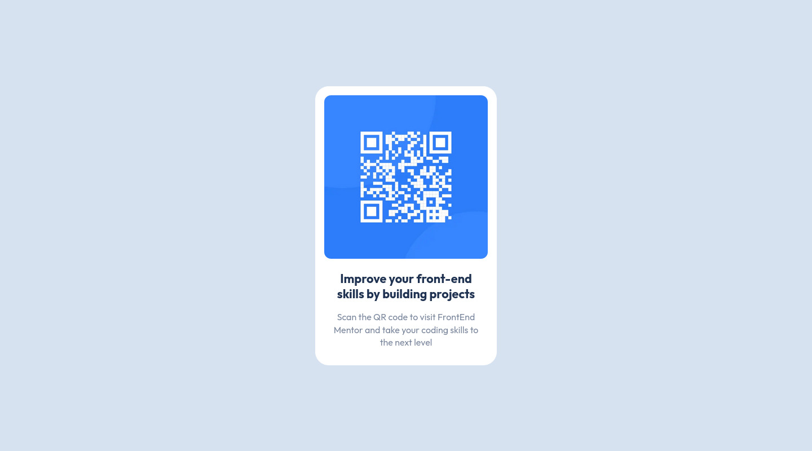

# Frontend Mentor - QR code component solution

This is a solution to the [QR code component challenge on Frontend Mentor](https://www.frontendmentor.io/challenges/qr-code-component-iux_sIO_H). Frontend Mentor challenges help you improve your coding skills by building realistic projects.

## Table of contents

- [Overview](#overview)
  - [Screenshot](#screenshot)
  - [Links](#links)
- [My process](#my-process)
  - [Built with](#built-with)
  - [What I learned](#what-i-learned)
  - [Continued development](#continued-development)
  - [Useful resources](#useful-resources)
- [Author](#author)
- [Acknowledgments](#acknowledgments)

## Overview

### Screenshot

### Links

- Solution URL: [Add solution URL here](https://github.com/ttsoares/qrcode)
- Live Site URL: [Add live site URL here](https://qrcode-eight-ebon.vercel.app/)

## My process

### Built with

- TailwindCSS custom properties
- Flexbox
- [React](https://reactjs.org/) - JS library
- [Next.js](https://nextjs.org/) - React framework
- [tailwindCSS](https://tailwindcss.com/) - For styles

### What I learned

This was my very first project here in FEM but, some how, forgot to post my solution...

### Continued development

Every opportunity with Tailwind something new emerges... Even is small code as this one !

### Useful resources

- [TailwindCSS](https://tailwindcss.com/docs/) - Tailwind CSS works by generating the corresponding styles and then writing them to a static CSS file.

## Author

- Website - [Thomas Tschoepke Soares](https://www.linkedin.com/in/thomas-soares-6791781b/)
- Frontend Mentor - [@ttsoares](https://www.frontendmentor.io/profile/ttsoares)

## Acknowledgments

Several very useful Youtube videos from nice persons helping the IT community...
